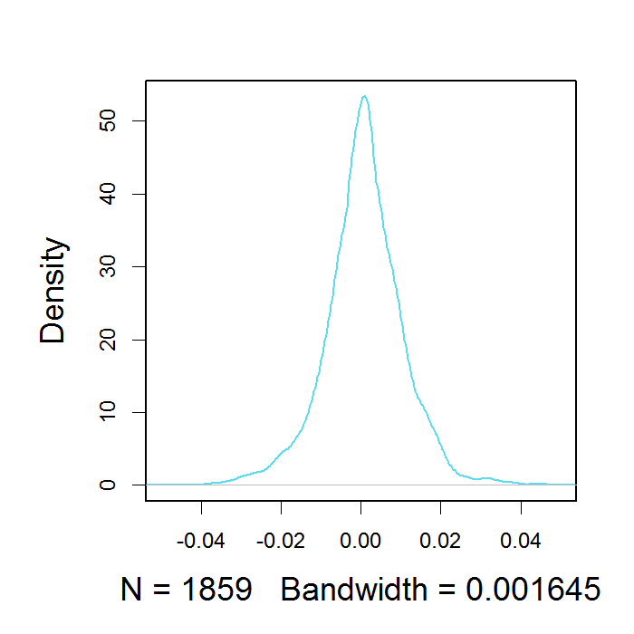

[](http://quantlet.de/index.php?p=info)

## [](http://quantlet.de/) **BCS_KernelDAX** [](http://quantlet.de/d3/ia)

```yaml

Name of Quantlet : BCS_KernelDAX

Published in : Basic Elements of Computational Statistics

Description : 'A simple density estimation with the epanechnikov kernel for the DAX log-returns.
The plot states the number of obervations N = 1859 and the auto-selected bandwidth, optimally
chosen by the function density equal to 0.001645.'

Keywords : 'kernel,bandwidth,weights,density estimation,plot,nonparametric, kernel density
estimation,DAX,log-returns,epanechnikov'

See also :

Author : [New] Christoph Schult

Submitted : 2016-01-28, Christoph Schult

Output : 'One plot for a kernel density estimation of the DAX log-returns by the density function
with the epachenikov kernel.'

```




```r
graphics.off()  # reset previous graphical settings
require(datasets)  # load required dataset 
r.dax = diff(log(EuStockMarkets[, 1]))  # define the log retunrs for the DAX index

par(mar = par()$mar + c(0, 1.5, -1, 0.1), cex = 1.5, cex.lab = 1.5, lwd = 2)
y = density(r.dax, kernel = "epanechnikov")  # density estimation for DAX log-returns
plot(y, xlim = c(-0.05, 0.05), col = rgb(0.1, 0.8, 0.9, alpha = 0.7), main = "")
```
